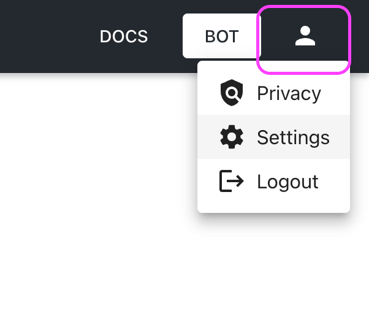
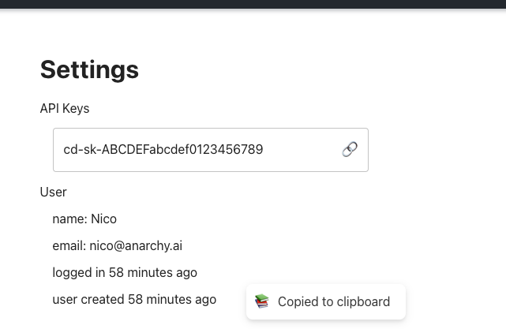

# Getting the keys

To get an api key, log in to [https://chat.dev/](https://chat.dev/) and access the page [https://chat.dev/settings](https://chat.dev/settings).

Once you have accessed the page you will see an API Key (or more, depending on your subscription plan.)

Click on the `🔗` icon to copy the key to the clipboard

