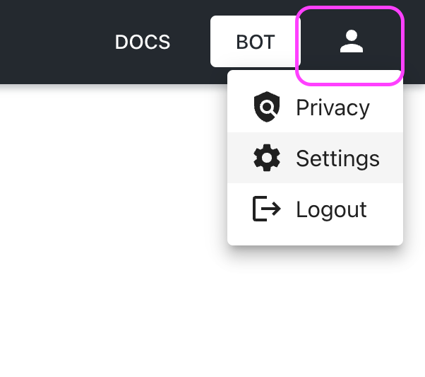
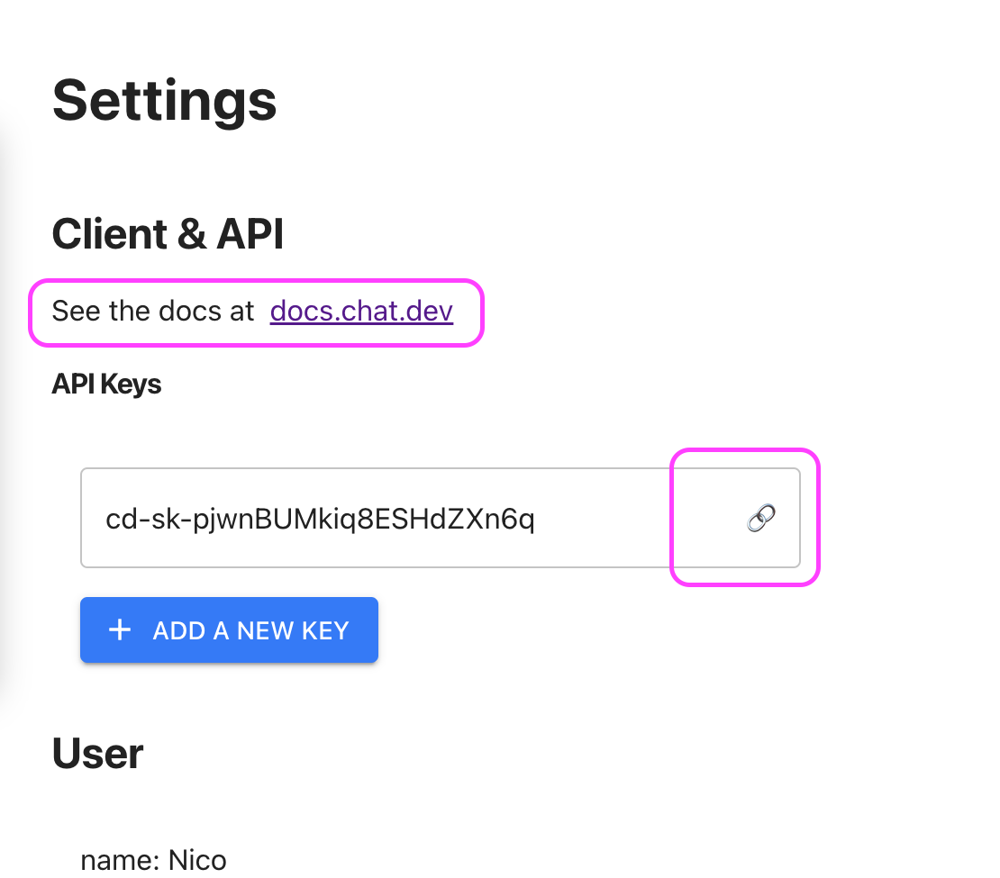
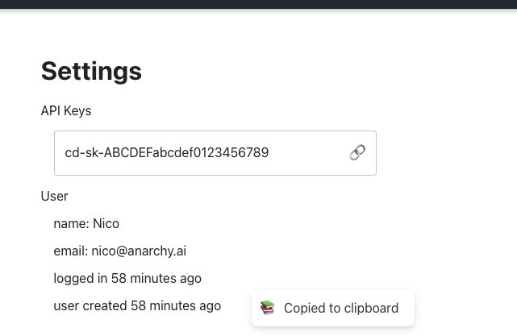

# How to get an API Key

To get an api key, log in to [https://chat.dev/] and access the page [https://chat.dev/settings]. 

Once you have accessed the page you will see an API Key (or more, depending on your subscription plan.)

Click on the `🔗` icon to copy the key to the clipboard

